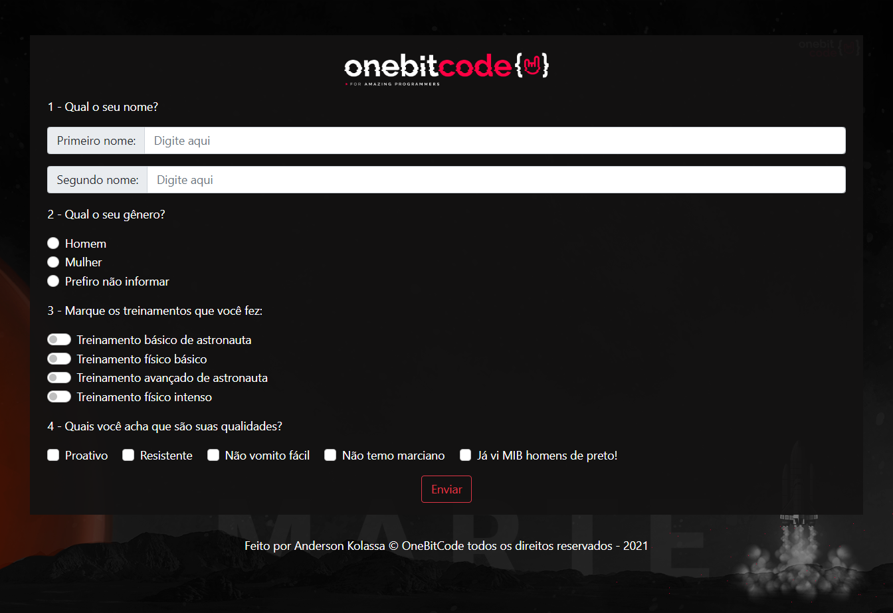

<h1 align="center"> Recrutamento de Astronautas </h1>

Exercício de fixação no módulo de Bootstrap do curso Full Stack Javascript da OneBitCode  

  <a href="#-tecnologias">Tecnologias</a>&nbsp;&nbsp;&nbsp;|&nbsp;&nbsp;&nbsp;
  <a href="#-projeto">Projeto</a>&nbsp;&nbsp;&nbsp;|&nbsp;&nbsp;&nbsp;

 

  

## 🚀 Tecnologias

Esse projeto foi desenvolvido com as seguintes tecnologias:

- HTML e CSS
- Sass
- Bootstrap
- Git e Github

## 💻 Projeto

É um formulário para fazer o recrutamento dos melhores astronautas disponíveis para ir a Marte.

- [Acesse o projeto finalizado, online](https://anderson-kolassa.github.io/Recrutamento-de-Astronautas/)

